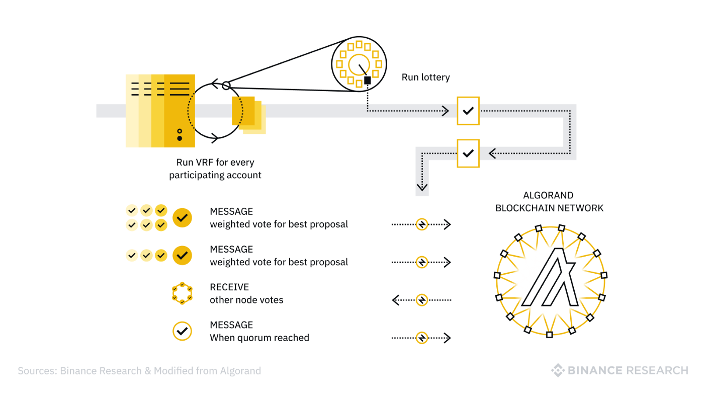
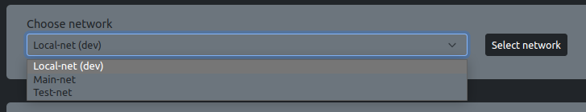
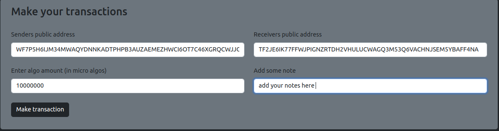
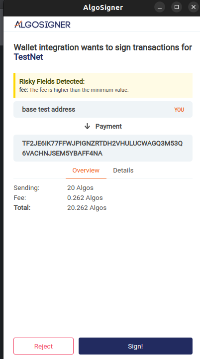
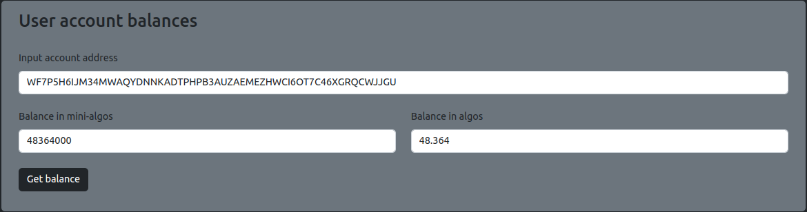
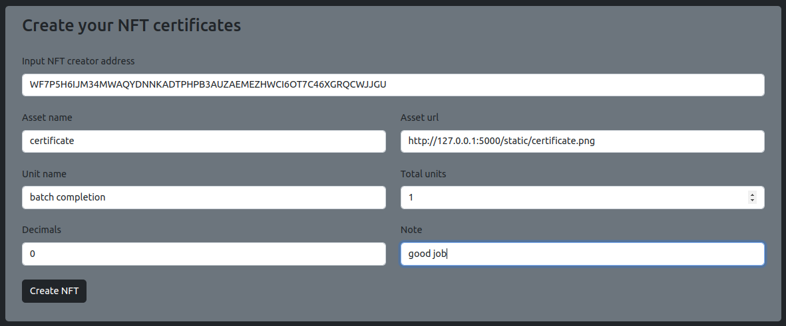

# A decentralized application using the Algorand blockchain network

An end-to-end Web3 dApp: certificate generation, distribution, and value and transaction transfer with Algorand NFTs and smart contracts.

## The Algorand blockchain network



**Table of contents**

- [Overview](#overview)
- [Objective](#objective)
- [Requirements](#requirements)
- [Install](#install)
- [How to use the dApp](#examples)
- [The decentralized application](#DApp)
- [Scripts](#scripts)
- [Test](#test)
- [Author](#author)

## Overview

> Web3 is the third generation of the web, or the commonly known and referred to communication network that we all love and call the internet. But Web3 is much more than the commonly known communication network and its uses. Web3 technology is inherently about the user controlled internet. It is being achieved by a growing stack of decentralized technologies, such as blockchains, smart contracts, oracles, crypto wallets, storage networks, and more.

## Objective

> In this project the main objective is to build an end-to-end Web3 decentralized application on the Algorand Blockchain that will help its client generate and distribute Non-Fungible Tokens (NFTs) as certificates that will represent the successful completion of a task or project to its customers, and allow its customers that are holding these NFTs to interact with a smart contract to perform pre-defined actions.

## Requirements

> Python 3.5 or above
>
> Pip
>
> py-algorand-skd
>
> Flask

## Install

### Installing the Algorand Sandbox environment (Optional - for development use only)

```
git clone https://github.com/algorand/sandbox.git
cd sandbox
./sandbox up
```

- Detailed guidelines and instructions to develop with the Algorand sandbox could be found [here](https://github.com/algorand/sandbox)

### Installing the decentralized application

```
git clone https://github.com/Fisseha-Estifanos/algorand_dApp.git
cd algorand_dApp
pip install -r requirements.txt
```

## Examples

> ### Using the dApp

- One can start using the dApp by first cloning the repo and going to the dApp directory as shown above or can direct interact with the hosted version by going [here](https://stirring-tarsier-1ebb66.netlify.app/)

- If you choose the first option run the following command after navigating to the dApp directory to start the backend engine.

```
pip install -r requirements.txt
python algorand_dApp_back_end.py
```

- Navigate to the address provided on your local browser
- Install the AlgoSigner wallet on your browser from [here](https://chrome.google.com/webstore/detail/algosigner/kmmolakhbgdlpkjkcjkebenjheonagdm)

> #### Making transactions

- First navigate to the wallets tab.

- Start by selecting one of the provided Algorand networks as shown below.

  > 

- After selecting networks, addresses associated with that network will be found.

- You can now easily make transactors by entering user and receiver addresses along with the amount of algos to send and some notes as shown below.

  > 

- A pop up window will appear as shown below in order to grand access for the transaction. Grant the request and enter your AlgoSigner browser integration password.

  > 

- You can also easily check you balance as shown below.
  > 

> #### Creating NFT certificates

> First navigate to the NFT certificates tab.
>
> You can now create NFT certificates by entering the following parameters listed below.

- Asset name
- Asset URL
- Unit name
- Total units
- Decimals
- Note

* Note here that you first need to put your certificates in a distributed file management system, then input the address (url) of that certificate in the asset url input parameter.

  > - 

## DApp

> The decentralized application could be found here in the algorand_dApp folder.

## Scripts

> All the scripts and modules for the creation of NFT certificates, transaction handling, smart contracts and any other helper scripts and modules along with default parameters and values used will be found here, in the scripts folder.

## Tests

> All the unit and integration tests are found here in the tests folder.

## Author

> 👤 **Fisseha Estifanos**
>
> - GitHub: [Fisseha Estifanos](https://github.com/fisseha-estifanos)
> - LinkedIn: [Fisseha Estifanos](https://www.linkedin.com/in/fisseha-estifanos-109ba6199/)
> - Twitter: [Fisseha Estifanos](https://twitter.com/f0x__tr0t)

## Show us your support

> Give us a ⭐ if you like this project, and also feel free to contact us at any moment.
